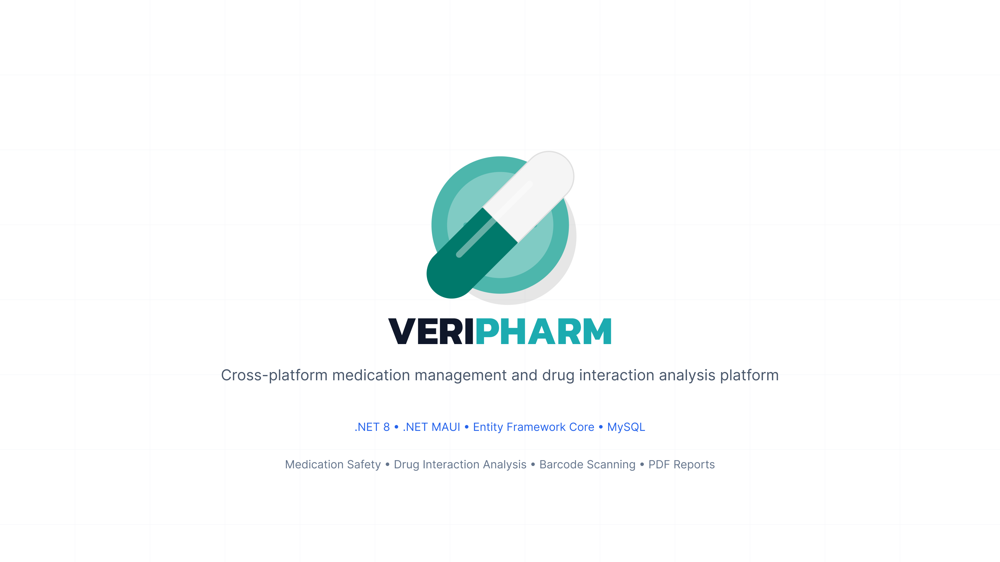

# 💊 VeriPharm

  

  <b>Cross-platform Medication Management & Drug Interaction Analysis Platform</b>

  A modern healthcare system built with .NET 8 and .NET MAUI

  <i>Minimal • Scalable • Cloud-enabled • Safety-focused</i>

---

  
  
  
  

---

## 🧭 Overview

**VeriPharm** is a cross-platform healthcare application designed to improve medication safety and support drug interaction analysis through structured pharmaceutical data management.

## 🌐 Project Website & Downloads

Official project website and full documentation: **[OttyQ.github.io/VeriPharm](https://OttyQ.github.io/VeriPharm/)**

### 📥 Download Latest Release (v0.1)
- 🪟 **[Download for Windows (.zip)](https://github.com/OttyQ/VeriPharm/releases/download/v0.1/VeriPharm-Windows-v0.1.zip)** (Self-contained)
- 📱 **[Download for Android (.apk)](https://github.com/OttyQ/VeriPharm/releases/download/v0.1/VeriPharm-Android-v0.1.apk)**

---

## ✨ Key Features

- 💊 Medication management and patient drug records  
- ⚠️ Drug interaction analysis engine  
- 📦 Barcode-based medication identification  
- 📄 Automated PDF report generation  
- 🖥️ Cross-platform support (Android • Windows)  
- ☁️ Cloud-hosted database (Clever Cloud MySQL)  

---

## 🧩 Problem Statement

Medication errors are among the most common and preventable risks in healthcare systems.

VeriPharm addresses this by combining:

- structured medical data handling  
- automated interaction detection  
- consistent cross-platform UX  

---

## 🏗️ Architecture

- .NET 8  
- .NET MAUI  
- Entity Framework Core  
- MySQL (Clever Cloud hosted)  
- Modular layered architecture  

---

## ⚙️ Tech Stack

| Layer | Technology |
|------|------------|
| UI | .NET MAUI |
| Backend | .NET 8 |
| ORM | Entity Framework Core |
| Database | MySQL (Cloud) |
| Reports | PDF Generation |

---

## 📱 Platforms

- Android  
- Windows  

---

## 🔍 Core Modules

### 💊 Medication Safety
Structured management of prescriptions and medication data.

### ⚠️ Drug Interaction Analysis
Detection of potentially harmful drug combinations.

### 📦 Barcode Scanning
Fast identification of medications via barcode input.

### 📄 PDF Reports
Exportable structured medical documentation.

---

## 🧠 Design Principles

- Minimal and functional UI  
- Data-first architecture  
- No visual noise  
- Consistent cross-platform experience  

---

## 🚀 Project Status

  

The system is under active development with focus on scalability, maintainability, and healthcare data safety.

---

## 📄 License

MIT License
